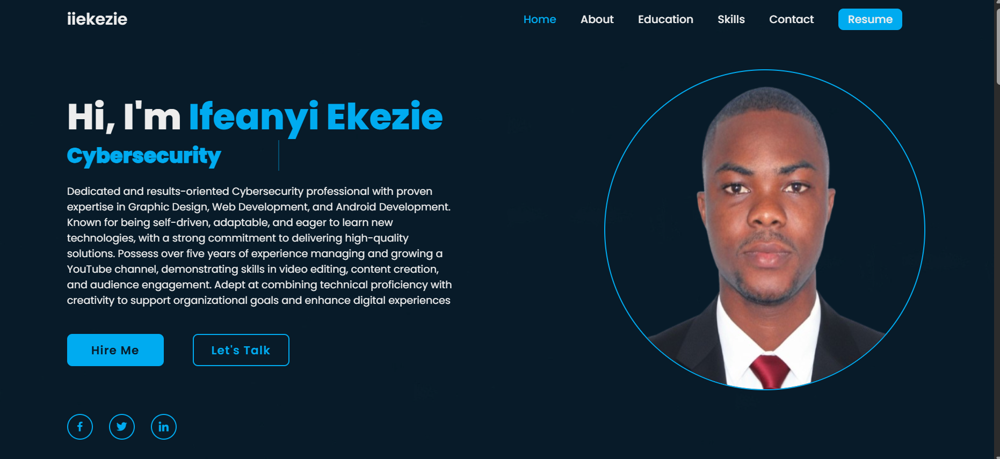

# ALX Professional Milestone Project  

## Author  
**Ifeanyi Ekezie**

## Project Overview  
This repository contains the deliverables for my **ALX Professional Milestone Project**.  
It demonstrates my ability to build and present a professional personal portfolio website aligned with my career goals in **Cybersecurity**.  

The project showcases:  
- My updated personal portfolio website.  
- My improved bio and branding.  
- My elevator pitch integration.  
- Feedback implementation from peers.  
- Updated skills map.  

## Website Link  
Visit my updated portfolio website here:  
🔗 [https://iiekezie.netlify.app/](https://iiekezie.netlify.app/)

## Screenshot (Desktop View)  

<figure>
  <figcaption>Screenshot 1 (on desktop screen)</figcaption>
  
</figure>

## Reflection  
Through this project, I strengthened my personal brand, showcased my cybersecurity passion, and demonstrated my ability to create a consistent, professional online presence. This milestone marks a significant step in my career journey.

## Skills Highlighted  
- Cybersecurity Awareness & Best Practices  
- Personal Branding & Portfolio Development  
- Website Design & Consistency  
- Elevator Pitch Delivery  

## How to View  
1. Clone this repository:
   ```bash
   git clone <repo-url>
